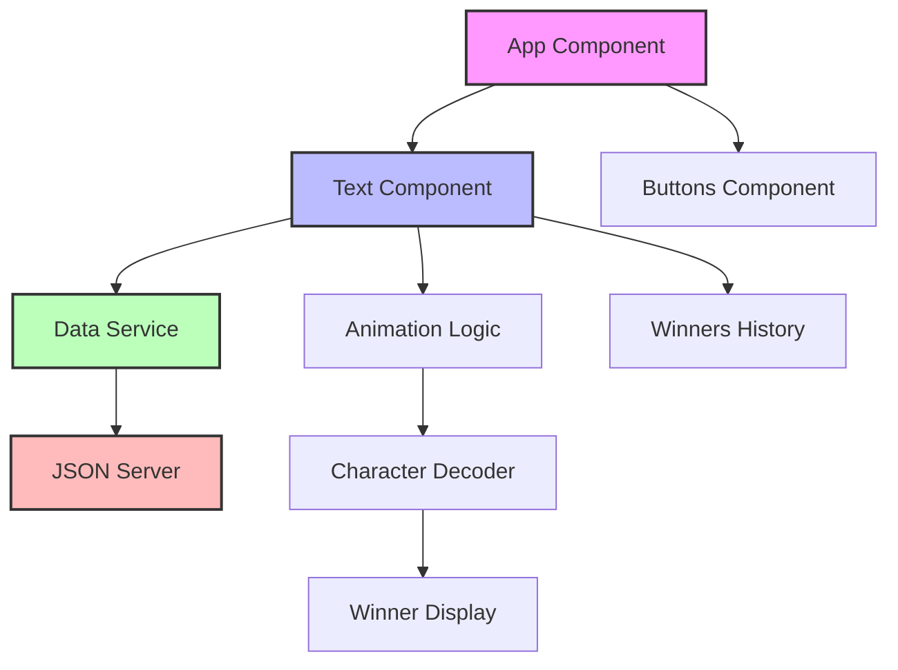
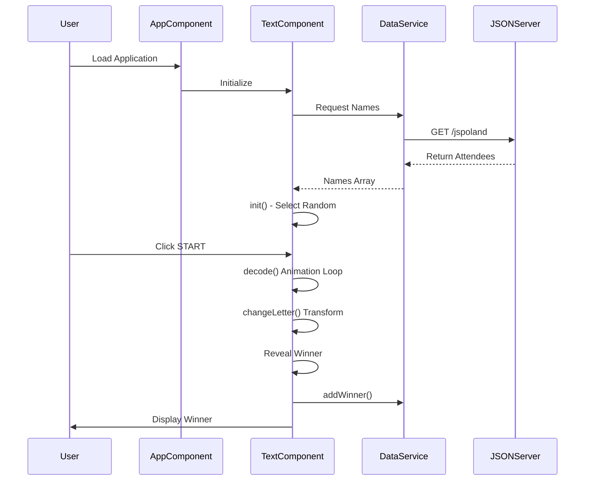

# Angularil Lottery

An Angular-based lottery system for Angular-IL community meetup raffles. Features a Matrix-style animated text reveal that randomly selects and displays winners from an attendee list with support for both Hebrew and English names.

Built in 2017. This Angular 4 application provides an interactive and visually engaging way to conduct raffles at tech meetups and community events.

## Features

### Core Capabilities

- **Random Winner Selection**: Guided selection from a pre-defined attendee list.
- **Matrix Animation**: Visually striking character reveal effect for winner announcements.
- **Bilingual Support**: Full compatibility with Hebrew and English character sets.
- **Real-time Data**: Dynamic fetching from a mock REST API.

### Technical Excellence

- **Angular Framework**: Built with Angular 4 for robust component-based development.
- **Material Design**: Modern UI components using Angular Material.
- **TypeScript**: Strict typing and modern JavaScript features.
- **RxJS**: Reactive data handling for asynchronous operations.

### Developer Experience

- **Mock Backend**: Integrated JSON Server for easy data management.
- **CLI Tooling**: Standard Angular CLI for development, building, and testing.
- **Hot Reloading**: Instant feedback during development.
- **Modular Design**: Clean separation of concerns between components and services.

- 🎲 Random winner selection from attendee pool
- 🎬 Matrix-style character animation reveal effect
- 🌐 Bilingual support (Hebrew & English)
- 📝 Winners history tracking
- 🎨 Material Design UI with Angular Material
- 🔄 Reset functionality for multiple rounds
- 📊 Real-time data fetching via JSON Server
- 📱 Responsive design

## Getting Started

### Prerequisites

- Node.js (v6 or higher)
- npm or yarn
- Angular CLI

### Installation

1. Clone the repository:

```bash
git clone https://github.com/orassayag/angularil-lottery.git
cd angularil-lottery
```

2. Install Angular CLI globally:

```bash
npm install -g @angular/cli
```

3. Install dependencies:

```bash
npm install
# or
yarn install
```

### Configuration

Edit the attendee list in `db.json`:

```json
{
  "jspoland": [
    { "name": "John Doe" },
    { "name": "Jane Smith" },
    { "name": "ישראל ישראלי" }
  ],
  "meetup": []
}
```

Adjust animation settings in `src/app/app.component.ts`:

- `maxIterations`: Animation cycle count (default: 250)
- `speed`: Animation speed in milliseconds (default: 17ms)

## Usage

### Running the Application

1. Start the JSON Server (serves attendee data):

```bash
npm run db
```

2. In a separate terminal, start the development server:

```bash
ng serve
```

3. Navigate to `http://localhost:4200` in your browser

## Available Scripts

### Data Server

```bash
npm run db
```

Starts the JSON Server on `http://localhost:3000` to serve the attendee list.

### Development Server

```bash
ng serve
```

Runs the development server on `http://localhost:4200`.

### Testing

```bash
ng test
```

Executes unit tests via Karma.

### Linting

```bash
ng lint
```

Runs TSLint to check code quality.

### Build

```bash
ng build
```

Compiles the application for production.

### Operating the Lottery

1. **INIT** - Click to randomly select a name from the pool
2. **START** - Click to begin the animated reveal
3. **Watch** - The Matrix-style animation decodes the winner's name
4. **Repeat** - Initialize again for additional winners

## Architecture

### Architecture Principles

- **Unidirectional Data Flow**: Data flows from parent to child components via inputs.
- **Separated Concerns**: Business logic is isolated in services, keeping components focused on UI.
- **Dependency Injection**: Services are injected for better modularity and testability.
- **Reactive Programming**: Using RxJS for efficient data handling.

### Directory Structure

```
src/
├── app/                    # Main application logic
│   ├── app.component.ts    # Root container
│   ├── app.module.ts       # Module definitions
│   ├── text.component.ts   # Lottery animation
│   ├── buttons.component.ts# UI controls
│   └── data.service.ts     # API integration
├── environments/           # Configuration files
├── assets/                 # Static resources
├── index.html              # Entry HTML
└── main.ts                 # Bootstrap script
```

### Design Patterns

- **Observer Pattern**: Using Observables to stream data from services to components.
- **Singleton Pattern**: Angular services act as singletons for shared state.
- **Component Pattern**: Encapsulating UI and behavior into reusable blocks.

### Component Flow





## Project Structure

```
angularil-lottery/
├── src/
│   ├── app/
│   │   ├── app.component.ts       # Main app container
│   │   ├── app.module.ts          # App module & dependencies
│   │   ├── text.component.ts      # Lottery animation logic
│   │   ├── buttons.component.ts   # Control buttons UI
│   │   └── data.service.ts        # Data fetching service
│   ├── environments/              # Environment configs
│   │   ├── environment.ts
│   │   └── environment.prod.ts
│   ├── main.ts                    # Bootstrap entry point
│   ├── polyfills.ts              # Browser polyfills
│   └── styles.css                # Global styles
├── db.json                        # Attendee database
├── package.json
├── tsconfig.json
├── tslint.json
└── .angular-cli.json
```

## How It Works

### Animation Algorithm

1. **Initialization**: A random name is selected from the attendee pool
2. **Masking**: The name is initially hidden with underscores
3. **Decoding Loop**:
   - Characters cycle through random replacements
   - After 50 iterations, correct letters lock in place
   - Continues until `maxIterations` is reached
4. **Reveal**: Final name is displayed and added to winners list

### Character Pool

The animation uses a diverse character set:

- Numbers: 0-9
- Uppercase: A-Z
- Lowercase: a-z
- Symbols: `%!@&*#_`
- Hebrew: אבגדהוזחטיכךלמםנןסעפףצץקרשת

### Hebrew Support

- Hebrew names are automatically detected by checking the first character
- Display order is reversed for proper right-to-left rendering
- All Hebrew characters are supported in the animation

## Best Practices

- **Component Isolation**: Each UI element is a self-contained component for better maintainability.
- **Service-Based Data**: Business logic is decoupled from the UI in dedicated services.
- **Environment Configurations**: Use separate environment files for development and production settings.
- **Linting**: Consistent code style is enforced by TSLint for quality assurance.
- **Strict Typing**: Leverage TypeScript's type system to catch errors at compile-time.

## Build

### Development Build

```bash
ng build
```

### Production Build

```bash
ng build --prod
```

Build artifacts are stored in the `dist/` directory.

## Development

The project uses:

- **Angular 4.x** - Core framework
- **Angular Material 2.x** - UI components
- **TypeScript 2.2** - Type-safe JavaScript
- **RxJS 5.x** - Reactive programming
- **json-server** - Mock REST API

### Testing

```bash
ng test        # Unit tests via Karma
ng e2e         # End-to-end tests via Protractor
```

### Linting

```bash
ng lint        # TSLint code quality check
```

## Contributing

Contributions to this project are [released](https://help.github.com/articles/github-terms-of-service/#6-contributions-under-repository-license) to the public under the [project's open source license](LICENSE).

Everyone is welcome to contribute. Contributing doesn't just mean submitting pull requests—there are many different ways to get involved, including answering questions and reporting issues.

Please feel free to contact me with any question, comment, pull-request, issue, or any other thing you have in mind.

See [CONTRIBUTING.md](CONTRIBUTING.md) for detailed guidelines.

## Credit

- Nir Kaufman - https://github.com/nirkaufman

## Acknowledgments

- Built for educational and research purposes
- Respects robots.txt and implements rate limiting
- Uses user-agent rotation to avoid detection
- Implements polite crawling practices

## Author

- **Or Assayag** - _Initial work_ - [orassayag](https://github.com/orassayag)
- Or Assayag <orassayag@gmail.com>
- GitHub: https://github.com/orassayag
- StackOverflow: https://stackoverflow.com/users/4442606/or-assayag?tab=profile
- LinkedIn: https://linkedin.com/in/orassayag

## License

This application has an MIT license - see the [LICENSE](LICENSE) file for details.
